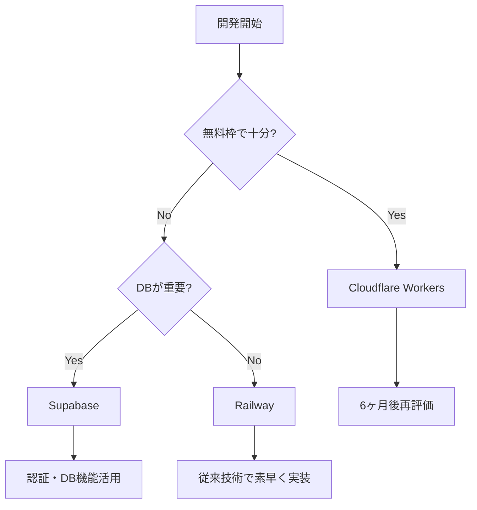
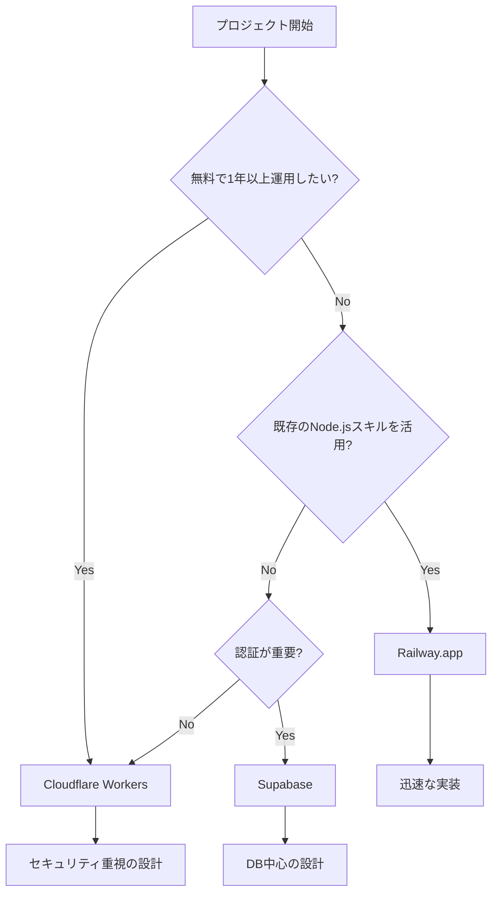

# プラットフォーム比較ガイド

## 更新履歴
- 2024-12-XX: 初版作成、無料枠でのWebSocket実装選択肢を比較

## 1. 比較対象プラットフォーム

無料で始められるWebSocketホスティングサービスを比較し、プロジェクトの要件に最適なプラットフォームを選択するためのガイドです。

## 2. 比較表

| プラットフォーム | 初期費用 | 月額費用 | 無料枠 | 学習コスト | Chrome拡張対応 | 推奨度 |
|-----------------|----------|----------|---------|------------|----------------|--------|
| **Cloudflare Workers** | 無料 | $5～ | 100K req/日 | ⭐⭐⭐ | ✅ | ⭐⭐⭐⭐⭐ |
| **Supabase Realtime** | 無料 | $25～ | 500MB DB | ⭐⭐ | ✅ | ⭐⭐⭐⭐ |
| **Railway.app** | 無料 | $5～ | $5クレジット/月 | ⭐⭐ | ✅ | ⭐⭐⭐⭐ |
| **Vercel + Pusher** | 無料 | $20～ | 200接続 | ⭐ | ✅ | ⭐⭐⭐ |
| **Heroku** | 有料のみ | $7～ | なし | ⭐⭐ | ✅ | ⭐⭐ |

## 3. 詳細比較

### 3.1 Cloudflare Workers + Durable Objects（推奨）

#### ✅ メリット
- **優秀な無料枠**: 100,000リクエスト/日は小規模運用に十分
- **統合された環境**: Workers + D1 + Durable Objectsが連携
- **グローバル配信**: エッジロケーションでの低遅延
- **セキュリティ機能**: WAF、DDoS保護が標準装備
- **WebSocket最適化**: Durable Objectsで状態管理が簡単

#### ❌ デメリット
- **学習コスト**: Cloudflare特有のAPIとアーキテクチャ
- **デバッグの難しさ**: ローカル開発環境の制約
- **ベンダーロックイン**: Cloudflare固有の機能に依存

#### 💰 コスト試算
```
無料枠: 100,000リクエスト/日
有料移行: $5/月で1,000万リクエスト

想定使用量（100ユーザー、1日4時間利用）:
- WebSocket接続: 400接続/日
- メッセージ交換: 50,000リクエスト/日
→ 無料枠で十分カバー可能
```

#### 🔧 実装例
```javascript
// Cloudflare Workers + Durable Objects
export class ChatRoom {
  constructor(state, env) {
    this.state = state;
    this.env = env;
    this.sessions = new Map();
  }

  async fetch(request) {
    const upgradeHeader = request.headers.get('Upgrade');
    if (upgradeHeader === 'websocket') {
      return this.handleWebSocket(request);
    }
    return new Response('Expected WebSocket', { status: 400 });
  }

  async handleWebSocket(request) {
    const pair = new WebSocketPair();
    await this.handleSession(pair[1]);
    return new Response(null, { status: 101, webSocket: pair[0] });
  }
}
```

### 3.2 Supabase Realtime

#### ✅ メリット
- **包括的な機能**: 認証、データベース、リアルタイム通信が統合
- **PostgreSQL基盤**: 標準SQLが使用可能
- **豊富なSDK**: JavaScript、TypeScript等の公式サポート
- **簡単な認証**: Row Level Security (RLS) で細かな権限制御

#### ❌ デメリット
- **データベース中心**: ファイルアップロード等には不向き
- **コスト上昇**: 無料枠超過時の料金が高め
- **カスタマイズ制限**: PostgreSQLの範囲での実装のみ

#### 💰 コスト試算
```
無料枠: 500MBデータベース、2GB転送
有料移行: $25/月で8GBデータベース

想定使用量:
- メッセージデータ: 10MB/月
- リアルタイム転送: 500MB/月
→ 無料枠で6ヶ月以上運用可能
```

#### 🔧 実装例
```javascript
// Supabase Realtime
import { createClient } from '@supabase/supabase-js'

const supabase = createClient(url, key)

// リアルタイムチャンネル作成
const channel = supabase
  .channel(`room-${roomKey}`)
  .on('broadcast', { event: 'message' }, (payload) => {
    displayMessage(payload);
  })
  .subscribe()

// メッセージ送信
channel.send({
  type: 'broadcast',
  event: 'message',
  payload: { text: 'Hello', userId: 'user123' }
})
```

### 3.3 Railway.app

#### ✅ メリット
- **従来型開発**: Node.js/Socket.IOをそのまま使用可能
- **簡単なデプロイ**: GitHubと連携した自動デプロイ
- **Docker対応**: 環境の移植性が高い
- **開発者体験**: 直感的なダッシュボード

#### ❌ デメリット
- **限定的な無料枠**: $5クレジット/月のみ
- **スケーリング課題**: 手動でのインスタンス管理
- **レイテンシ**: 単一リージョンでのホスティング

#### 💰 コスト試算
```
無料枠: $5クレジット/月
最小インスタンス: $5/月

想定使用量:
- 1インスタンス常時稼働: $5/月
→ 無料枠を即座に消費
```

#### 🔧 実装例
```javascript
// Railway + Socket.IO
const express = require('express');
const http = require('http');
const socketIo = require('socket.io');

const app = express();
const server = http.createServer(app);
const io = socketIo(server);

io.on('connection', (socket) => {
  socket.on('join-room', (roomKey) => {
    socket.join(roomKey);
    socket.to(roomKey).emit('user-joined', socket.id);
  });

  socket.on('message', (data) => {
    socket.to(data.roomKey).emit('message', data);
  });
});

server.listen(process.env.PORT || 3000);
```

### 3.4 Vercel + Pusher

#### ✅ メリット
- **分離アーキテクチャ**: フロントエンドとリアルタイム機能の分離
- **Vercelの最適化**: フロントエンドビルドとCDN配信
- **Pusher専門性**: WebSocket接続の安定性

#### ❌ デメリット
- **複雑な設定**: 2つのサービスの連携が必要
- **コスト構造**: 両サービスの料金発生
- **API制限**: Pusher APIの呼び出し制限

#### 💰 コスト試算
```
Vercel: 無料（ホビー利用）
Pusher: $20/月（最小有料プラン）

無料Pusher枠: 200接続、500K メッセージ/日
→ 本格運用には有料プランが必要
```

## 4. 推奨選択基準

### 4.1 プロジェクトフェーズ別推奨

| フェーズ | 規模 | 推奨プラットフォーム | 理由 |
|----------|------|---------------------|------|
| **MVP開発** | 5-10ユーザー | Cloudflare Workers | 無料枠が充実、学習価値高 |
| **β版テスト** | 50-100ユーザー | Supabase | 認証等の機能が豊富 |
| **本格運用** | 1000+ ユーザー | Railway or 自前サーバー | コスト効率と柔軟性 |

### 4.2 技術スキル別推奨

| 開発者レベル | 推奨プラットフォーム | 学習期間 |
|-------------|---------------------|----------|
| **初級者** | Supabase | 1-2週間 |
| **中級者** | Railway.app | 3-5日 |
| **上級者** | Cloudflare Workers | 1-2週間 |

### 4.3 コスト重視の選択



## 5. 実装工数比較

### 5.1 初期実装工数（WebSocketチャット機能）

| プラットフォーム | サーバー側 | クライアント側 | 認証実装 | 合計工数 |
|-----------------|------------|----------------|----------|----------|
| **Cloudflare** | 3-5日 | 2日 | 2-3日 | 7-10日 |
| **Supabase** | 1-2日 | 2日 | 1日 | 4-5日 |
| **Railway** | 2-3日 | 2日 | 2-3日 | 6-8日 |
| **Vercel+Pusher** | 1日 | 3日 | 3-4日 | 7-8日 |

### 5.2 運用・保守工数

| プラットフォーム | 監視 | スケーリング | セキュリティ | 月間工数 |
|-----------------|------|-------------|-------------|----------|
| **Cloudflare** | 自動 | 自動 | 高レベル標準 | 2-4時間 |
| **Supabase** | 自動 | 自動 | 中レベル標準 | 4-8時間 |
| **Railway** | 手動 | 手動 | 自己実装 | 8-16時間 |

## 6. 最終推奨

### 6.1 このプロジェクトでの推奨順位

1. **🥇 Cloudflare Workers + Durable Objects**
   - 理由: 無料枠が十分、将来性があり、Chrome拡張機能との相性が良い
   - 学習投資価値: Cloudflareエコシステムのスキル習得

2. **🥈 Supabase Realtime**  
   - 理由: 実装が簡単、認証機能が豊富
   - 適用場面: 認証が重要な場合、PostgreSQLスキルを活用したい場合

3. **🥉 Railway.app**
   - 理由: 従来技術で確実に実装可能
   - 適用場面: 短期間での確実な実装が必要な場合

### 6.2 決定フローチャート



---

## 次のステップ

プラットフォームを選択したら、対応する設定手順書を確認してください：

- **Cloudflare Workers** → [04-platform-setup.md](./04-platform-setup.md)
- **Supabase** → プラットフォーム設定手順書（別途作成）
- **Railway** → プラットフォーム設定手順書（別途作成）

実装詳細は [05-use-case-implementation.md](./05-use-case-implementation.md) を参照してください。